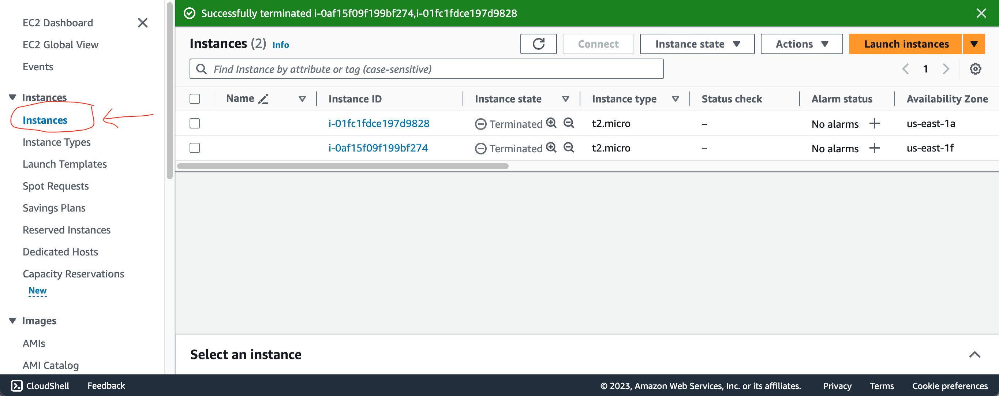
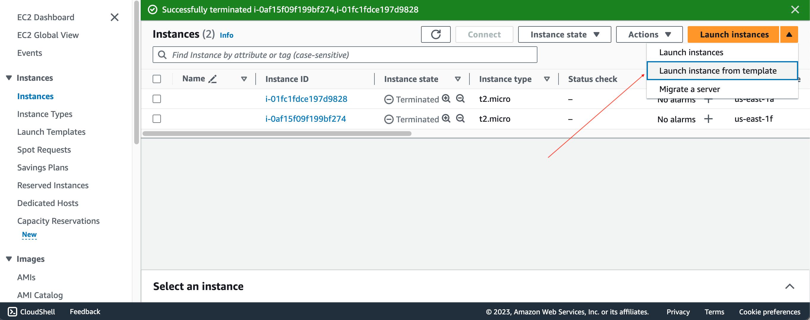
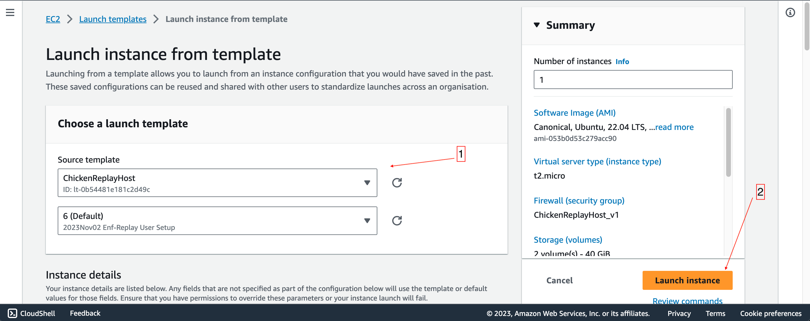

# ReplayTest
Distributed replay of transactions. Distributed to run entire history in a short period of time.

## Description
Spins up over many spot instances of nodoes and replays blocks. Each instance is designated to test a unique range of blocks. At the end of the range the integrity hash is checked against a previous run to ensure validity of the replay.

See [High Level Design](docs/high-level-design.md). The service has two components an orchestrator node, and many replay nodes. The replay nodes connect to the orchestrator via HTTP to fetch job configuration and update status.

For a description of the HTTP calls supported by the orchestrator see [HTTP Service Calls](docs/http-service-calls.md)

## Orchestrator Setup
First you need to setup an orchestrator, then you need to setup your relay nodes. Best way to do this is through the AWS portal. Not sure of the roles and permissions you need to start these services. If you would like to configure your own launch template see [AWS Host Setup](AWS-Host-Setup.md)

To setup your orchestrator node. Go to EC2 Instances

Select launch instance from template

Select `LowEndOrchestrator` and use the default template.

## Updating Orchestrator Job Configuration
Be default the setup will spin up a webservice with [test data](meta-data/test-simple-jobs.json). To change the job configuration you need to create your own JSON configuration, and restart the service to use the new JSON.
- Create your own JSON following the example formate from `test-simple-jobs.json`
- Upload the file to the orchestrator node
- Log into the service as `ubuntu` user
- Kill the existing service named `python3 ... webservice.py`
- Restart with your configuration `python3 $HOME/replay-test/orchestration-service/web_service.py --config my-config.json --host 0.0.0.0 &`

## Replay Setup
You can spin up as many replay nodes as you need. Each replay node is designed to use one replay slice configuration as provided in the JSON configuration file. If you have 100 replay slices configured you can utilize up to 100 replay hosts.

To setup your orchestrator node. Go to EC2 Instances

Select launch instance from template

Select `ChickenReplayHost` and use the default template.

Once your replay host is setup you need to ssh into the host and start the job.
- Grab the private IP of the orchestrator node
- SSH in as user `enf-replay`
- Run `$HOME/replay-test/replay-client/start-nodeos-run-replay X.X.X.X`
   - replacing the argument with the orchestrator node private IP
   - optionally provide a second argument for the orchestrator webservice port

**Alternative**: you can start a replay node on the command line from the orchestrator node. See [an example](scripts/run-replay-instance.sh).

## Viewing Status
You can see the status of jobs by using the webservice on the orchestrator node. Put `http://orchestor.example.com:4000/status`.

Look at [HTTP Service Calls](docs/http-service-calls.md) for other URL options and viewing options.

## Termination of Replay Nodes
Replay nodes are not automatically terminated. To save on hosting costs, it is advisable to terminate the nodes after the replay tests are completed.

## Testing
For testing options see [Running Tests](docs/running-tests.md)
