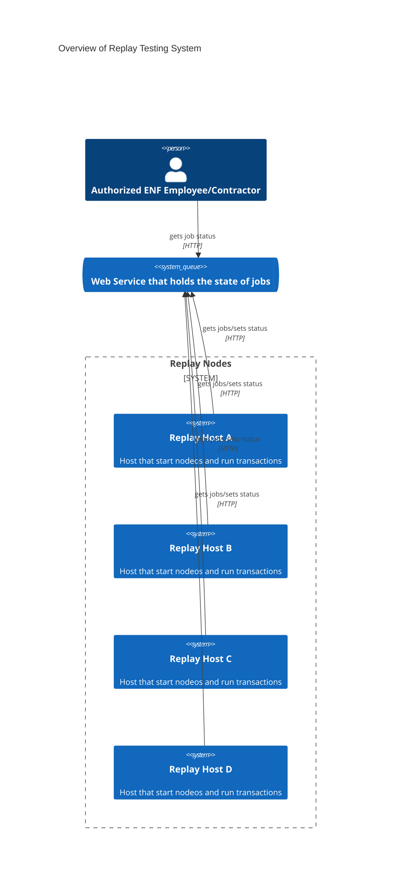

# High Level Design Document

This service is designed to run multiple hosts to download, install, run nodeos. Following that the host will load a snapshot and start syncing blocks to a specific block number. Once that process is finished the host will report back the integrity hash representing nodeos' final state.

## Overview 
Once replay hosts are spun up they contact the orchestration service to get the information needed to run their jobs. The replay hosts update the orchestration service with their progress and current status. The orchestration service is single threaded, and has checks to ensure there are not overwrites or race conditions. The replay nodes use increasing backoffs to avoid sending too many simultaneous requests. 

