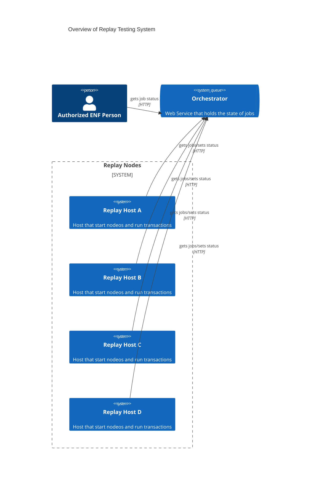
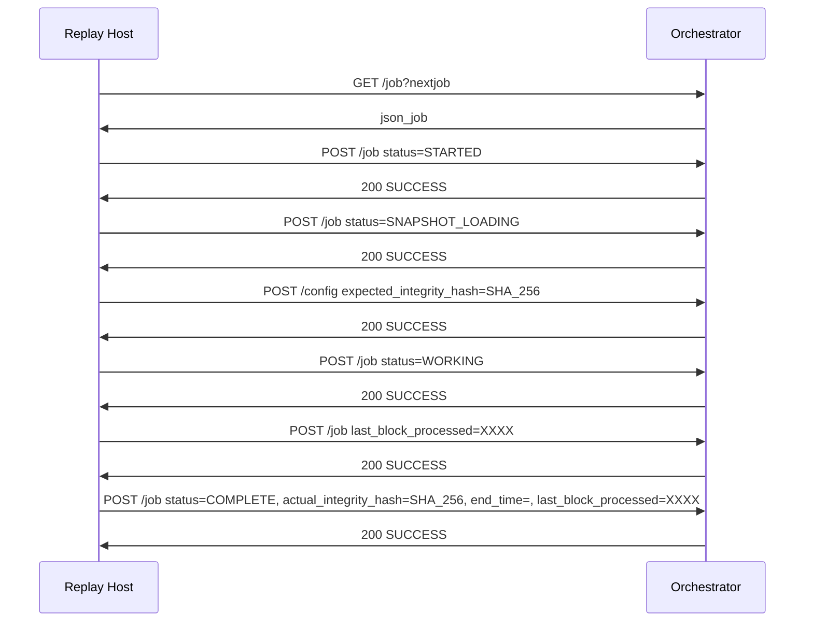

# High Level Design Document

This service is designed to run multiple hosts to download, install, run nodeos. Following that the host will load a snapshot and start syncing blocks to a specific block number. Once that process is finished the host will report back the integrity hash representing nodeos' final state.

See [Operating Details](./operating-details.md) for list of scripts, logs, and data.

## Overview
Once replay hosts are spun up they contact the orchestration service to get the information needed to run their jobs. The replay hosts update the orchestration service with their progress and current status. The orchestration service is single threaded, and has checks to ensure there are not overwrites or race conditions. The replay nodes use increasing backoffs to avoid sending too many simultaneous requests.

## Orchestrator Lifecycle

Current adding and tearing down replay hosts is a manual process that requires a human to log into the orchestrator host and run scripts.

Once the orchestrator is setup, and loaded with a configuration file, it has a list of jobs to run.
- Jobs all in `WAITING_4_WORKER` status
- Need replay hosts to pick and process jobs
The orchestrator spins up replay hosts via a command line script. This script passes the private ip of the orchestrator node along to the replay nodes.

At the end of the run, a script is called to terminate the replay node instances.

## Sequence
The relay host picks up a job, and updates the jobs status while it works through the lifecycle. A full list and description of the [HTTP API is documented separately](./http-service-calls.md). The relay host will update the progress by updating the last block processed. Full list of status is found here. https://github.com/eosnetworkfoundation/replay-test/blob/main/orchestration-service/job_status.py#L8-L15

## Details Steps for Replay
`replay-client/start-nodeos-run-replay.sh` a replay job, and updating status on orchestration service.
1. performs file setup: create dirs, get snapshot to load
2. GET job details from orchestration service, incls. block range
3. local non-priv install of nodeos
4. starts nodeos loads the snapshot, send integrity hash
   - sends the integrity hash from the snapshot back to orchestration service
   - the snapshot block height is the same as the start block height of this job
   - this integrity hash is the expected integrity for another job
   - the other job has the end block num matching the current job's start block num
5. replay transactions to specified block height from blocks.log or networked peers and terminates
6. restart nodeos read-only mode to get final integrity hash
7. POST completed status for configured block range
   - this is the actual integrity hash for this job
   - the actual integrity hash for the this jobs end block num
8. retain blocks logs copy over to cloud storage
   - checks cloud storage for existing blocks log
   - does not copy over if blocks log exists

Communicates to orchestration service via HTTP

## Replay Dependencies
Dependency on aws client, python3, curl, and large volume under /data

## Final Report
Final report shows
- number of blocks processed and percentage of total blocks processed
- number of successfully completed, failed jobs, and remaining jobs
- list of failed jobs with `Job Id`, `Configuration Slice`, and `Status`
